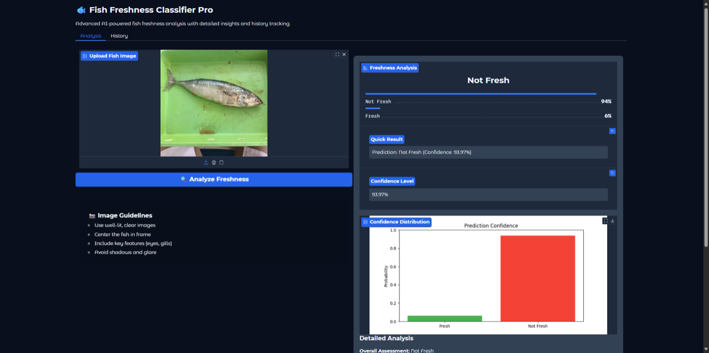
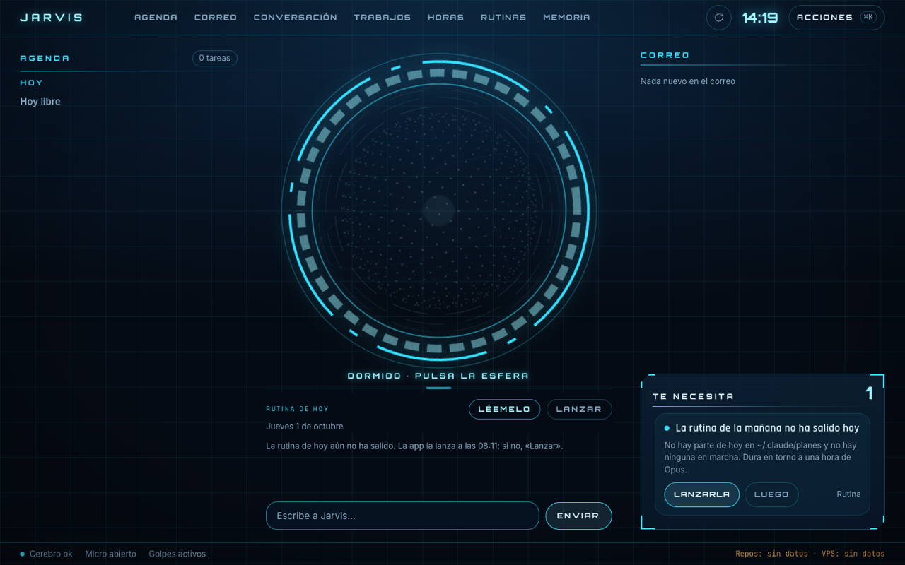
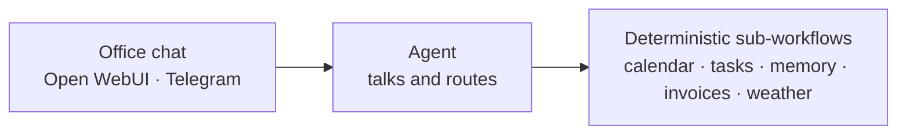
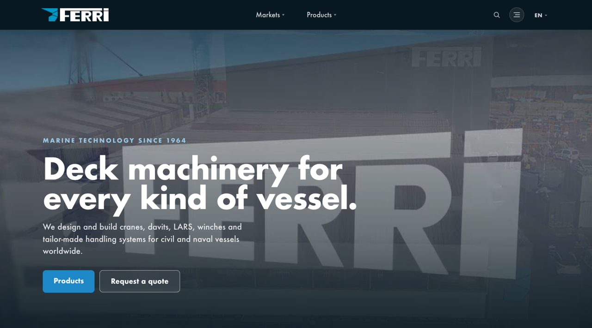

### Hi, I'm Roque 👋

AI engineer based in Vigo, Spain. I build AI systems end to end: the models, the agents and automations that use them, and the web around them. BSc in Artificial Intelligence, De Montfort University (2022–2025).

> My repositories are private. This page is the shop window; happy to walk you through any of them.

---

### 🐟 Fish freshness classifier · BSc dissertation

<table><tr>
<td width="48%"></td>
<td>

- Tells from a photo whether a fish is **fresh** or **not fresh**: no sensors, no lab.
- ~6,000 images from 4 public datasets, **relabelled by hand** for consistency.
- Compared EfficientNetB0/B4, MobileNetV2 and ResNet50 with transfer learning, plus my own **hybrid fusion model** that concatenates features from three of them.
- **EfficientNetB0: 98.2% accuracy, F1 0.98.** Real-time demo in Gradio.

`PyTorch` `transfer learning` `Gradio`

</td>
</tr></table>

### 🎙️ Jarvis · voice assistant that lives on my Mac

<table><tr>
<td width="48%"></td>
<td>

- “Hey Jarvis” → local wake word and Whisper → **Claude Code headless** → local voice → live HUD in the browser.
- Reads my calendar, Notion tasks and mail; **writes only when I tell it to**, and deletes only after a spoken “yes”.
- Delegates coding jobs to an agent locked in `sandbox-exec` that can only push to its own branch.
- Audio and voice never leave the machine.

`Python` `Whisper` `openWakeWord` `Claude` `TTS` `SSE`

</td>
</tr></table>

### ⚙️ AI agents for small businesses · n8n

- A multi-agent office assistant: the agent only **talks and routes**; every action runs in a **deterministic sub-workflow**, not as a loose tool.
- An AI receptionist for dental clinics over Telegram that books, reschedules and cancels appointments.
- Self-hosted on a VPS with Docker and Coolify.

`n8n` `Gemini` `Open WebUI` `Telegram` `Docker` `Coolify`

### 🌐 [ferri-sa.es](https://ferri-sa.es) · corporate website, live

<table><tr>
<td width="48%"></td>
<td>

- Full rebuild of the website of FERRI, a marine deck-machinery manufacturer founded in 1964.
- Three languages (ES / EN / GL), product catalogue and interactive 3D.
- Replaced the old WordPress site in production in August 2026.

`Astro` `React` `three.js`

</td>
</tr></table>

### 🎓 Degree coursework

Other work from the AI degree: robot localisation with an **Extended Kalman Filter**, a **fuzzy inference** system that estimates mental focus, **agent-based modelling** in NetLogo, a rice-variety **CNN** and a shallow neural network in MATLAB.
