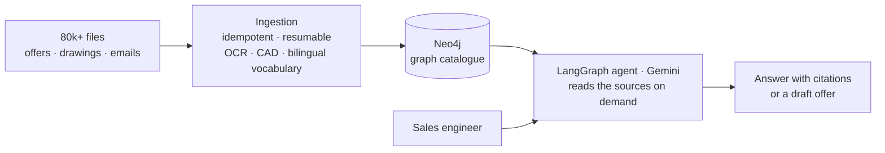
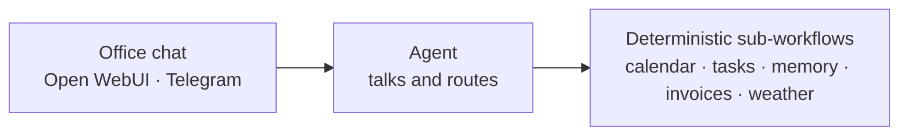

### Hi, I'm Roque 👋

AI engineer at **[FERRI](https://ferri-sa.es)**, a marine deck-machinery manufacturer in Vigo, Spain, where I'm building the AI department from scratch. I take AI from prototype to production: retrieval over decades of engineering offers, BI on top of a 20-year-old ERP, CAD-to-ERP automation. Outside work I build software and agents, and a voice assistant that runs my day.

**BSc (Hons) Artificial Intelligence, First Class** · De Montfort University (2022–2025)

> The code is private, so this page is the whole picture. Happy to walk you through any of it.

---

## 🏭 Building the AI department at FERRI · since 2025

### 🔎 Sales assistant: RAG over decades of engineering offers · pilot in production

- New offers used to be stitched together by hand from old projects found by intuition in network folders. Now you ask, get the sources cited, and a first draft.
- I took a vendor's prototype to a production pilot: dropped Elasticsearch so the graph is the single catalogue, made ingestion idempotent and resumable (MD5 audit, per-file error isolation), added a multimodal path for CAD drawings and won/lost outcomes read from the emails.
- **Evaluation before demos:** a deterministic benchmark of 80+ queries in 12 categories, **53/53** passing.
- **Measure before scaling:** an inventory of 80,652 files showed the ingestion selector covered only **14.7%** of them, so I stopped the rollout and replanned it in auditable batches.

`LangGraph` `Gemini (Vertex AI)` `Neo4j` `PostgreSQL` `FastAPI` `React` `Active Directory`

### 📊 BI on top of a 20-year-old ERP, without touching it · in production

- No schema docs, so I reverse-engineered it: ~1,460 tables, the 1,501 desktop screens as a blueprint of which fields matter, and ~30,000 labels mapped. GenAI only sped up the discovery; at runtime it's plain SQL.
- FastAPI (12 routers) and React, ~17 pages across 6 departments, Active Directory login and a 9-profile permission matrix checked user by user.
- The figures reconcile **to the euro** with the general ledger in the months verified with finance.
- Its deployment (private registry, nginx, loopback-only backend, versioned releases with a backup first) became the standard for every app after it.

`FastAPI` `React` `TypeScript` `SQL Server` `Active Directory` `Docker` `nginx`

### 🌐 [ferri-sa.es](https://ferri-sa.es) · corporate website, live

<table><tr>
<td width="48%"></td>
<td>

- Rebuilt in-house from scratch: 277 pages in Spanish, English and Galician, catalogue by market and a hero video with equipment hotspots.
- Mobile home page from **12 MB to 2.8 MB**; zero external hosts (self-hosted fonts, analytics only after consent).
- Replaced the old WordPress site with **zero downtime**: 271/271 sitemap URLs and 152/152 redirects verified after the switch.

`Astro` `React` `Tailwind` `MDX`

</td>
</tr></table>

### 🔩 More at FERRI

| Project | What I did |
|---|---|
| **Parametric fastener library** | Python drives SolidWorks' COM API to generate, verify and document DIN fasteners instead of remodelling hundreds of parts by hand: 7 families, ~44 parts verified. One standard had no written process, so I derived it by topological analogy with two others; the automatic check passed 4/4. |
| **Drawing → ERP bills of materials** | Extracts the BOM from the CAD assembly or the engineering PDFs (an LLM only for scanned drawings), validates every code against the ERP and writes the exact import file. 85–90% of a ~800-line typing job automated. |
| **Technical manuals that write themselves** | Crosses the CAD tree, the drawings and the spare-parts spreadsheets. Checked against 7 approved manuals: ~94% of paragraphs and ~95% of tables recreated, about 2 minutes per manual. |
| **Repairs calendar** | Cleaned 1,969 raw rows down to 289 vessels (the manual list knew ~150), then an inspection due-date engine and live order tracking from the ERP. In internal use. |
| **Supplier invoices** | Asked for an OCR upload portal; the regulatory analysis showed the law forbids forcing suppliers onto one, so before a line of code it became a universal inbox plus a three-way match against the ERP. |

## 🎙️ Jarvis · voice assistant

<table><tr>
<td width="48%"></td>
<td>

- “Hey Jarvis” (or a double knock on the laptop) → local wake word and Whisper → **Claude Code headless** → local voice → live HUD in the browser.
- Reads my calendar, Notion tasks and mail; **writes only when I tell it to** and deletes only after a spoken “yes”. Those limits live in code (hooks), not in the prompt.
- Delegates coding jobs to an agent locked in `sandbox-exec` that can only push to its own branch.
- Wake word, transcription and speech run locally; the model only receives text. The voice is a fine-tuned TTS model.
- 22 architecture decision records and ~1,750 tests.

`Python` `Whisper` `openWakeWord` `Claude` `TTS` `SSE`

</td>
</tr></table>

## 🐟 Fish freshness classifier · BSc dissertation

<table><tr>
<td width="48%"></td>
<td>

- Tells from a photo whether a fish is **fresh** or **not fresh**: no sensors, no lab.
- ~6,000 images from 4 public datasets, **relabelled by hand** for consistency.
- Compared EfficientNetB0/B4, MobileNetV2 and ResNet50 with transfer learning, plus my own **hybrid fusion model** that concatenates features from three of them.
- **EfficientNetB0: 98.2% accuracy, F1 0.98.** Real-time demo in Gradio.

`PyTorch` `transfer learning` `Gradio`

</td>
</tr></table>

## 🧩 Apps and agents

| Project | What it does | Stack |
|---|---|---|
| **Case management system** | Clients, case files by phase, deadlines counted in business days, grant calls, documents, agenda and search. A shared core with pluggable verticals. | `Next.js` `Payload` `PostgreSQL` `Playwright` |
| **Day-care centre management** | Attendance, resident records, transport, canteen, incidents and admissions, with role-based access. | `Next.js` `Payload` `PostgreSQL` `Playwright` |
| **Sports club website** | Full rebuild with an editable CMS: a benchmark of 19 clubs, content migration, redirects and analytics. | `Next.js` `Payload` |
| **Work-time register** | Spain's mandatory time tracking done by the book: immutable records with a separate corrections log, login by tax ID, an inspection-ready export. Multi-company, each one generated from a template. | `FastAPI` `Next.js` |
| **3D scrollytelling site** | A low-poly house renovates itself phase by phase as you scroll: a 195 KB 3D chunk, rendering only when something changes, and a complete static fallback. | `Astro` `three.js` `GSAP` |

### ⚙️ AI agents · n8n

- A multi-agent office assistant: the agent only **talks and routes**; every action runs in a **deterministic sub-workflow**, not as a loose tool.
- An AI receptionist over Telegram that books, reschedules and cancels appointments.
- An agent that audits websites for signs of age and rebuilds a demo from the site's own content and photos, inventing nothing.

`n8n` `Gemini` `Open WebUI` `Telegram` `Playwright` `Coolify`

## 🧪 Lab

| Project | What it is |
|---|---|
| **Mac sensors, the hard way** | Reverse-engineered the private trackpad framework on an M4 with macOS 26 (decoded the 96-byte touch struct from raw dumps, no permission prompts) and read the accelerometer at 804 Hz without root. The double-knock detector looks for a knock–silence–knock pattern, because to an accelerometer a key press *is* a knock, and a replay mode tests every threshold against recorded sessions. It now turns Jarvis's mic on and off. `Swift` |
| **Self-hosted platform** | One VPS with Coolify, Traefik, HTTPS and an auth gateway in front of n8n, Whisper, Open WebUI and the apps above. Raw ports closed in the `DOCKER-USER` chain, because Docker bypasses ufw. `Docker` `Coolify` `Traefik` |
| **My Claude Code workshop** | My `~/.claude` under version control: 9 global skills, a 53-skill library, agents and hooks (tests before every commit, a guard on pushes that deploy). It syncs every night, only after scanning for secrets and passing its own tests. Plus a one-page engineering standard by project stage that every repo carries. |
| **Group-trip PWA** | Tricount-style shared expenses and daily chronicles written by Gemini from the day's photos and events. `FastAPI` `Gemini` `PWA` |
| **Notion widgets and a phone HUD** | Zero-dependency widgets embedded in Notion (agenda, server status, monthly spending) and a PWA that puts Jarvis's tasks on my phone. |

## 🎓 Degree coursework

Other work from the AI degree: robot localisation with an **Extended Kalman Filter**, a **fuzzy inference** system that estimates mental focus, **agent-based modelling** in NetLogo, a rice-variety **CNN** and a shallow neural network in MATLAB.

---

📫 roquesobrino@gmail.com
